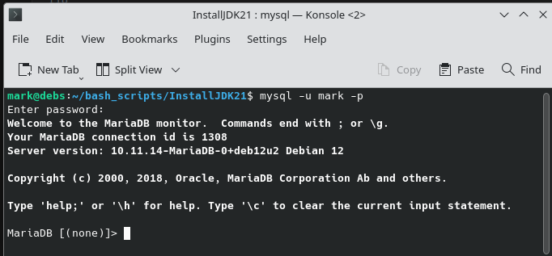
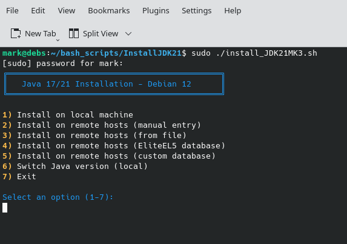

# Script that automattically installs JDK version 21  on Debian 12
     MD Harrington Kent London UK 
     Bexleyheath 
     DA68NP


## Overview

### This is handled in two scripts 

- 1 : a setup_DB_procedures.sh script to be initiated first 
- 2 : and install_JDKMK3.sh script 

## Absolute basic operation 

- Checks for Maria DB and install if not present along with users and tables  so that this becomes easy 

- Checks for Java 21 (OpenJDK 21) on each server
- Installs it automatically if it’s missing, using the Adoptium repository.
- Fetches a list of servers from a MariaDB database (eliteel5_servers → servers table).
- Runs these operations in parallel using SSH connections
- Logs results and provides a clean, interactive setup experience.

## Pre Requisits 

- Running Debian 12 as operating system 
- Maria DB  installed on local host 
- Ideally apache web server  should be installed along with php and phpmyadmin 
  

### Below is an example procedure that  you need to follow 

#### Steps to complete installation useing scripts provided 
### step 1

- Use the script named setup_DB_procedures.sh 

#### This will do the following 


- Create the $HOME/DB_bashscripts directory
- Copy itself to that directory (if not already there)
- Make the copied script executable
- Skip copying if it's already running from that location  
- It will test to see if mariadb is installed and if not will install this 
- Check for existance of users  should MariaDB be installed 
- Create new users and grant priviledges on those table  for users 
- Populate the table with name of the procedure  and store this in  Database: DB_Procedures 
- This will then call that procedure and create database named users_servers and within this then create table  named servers with the following fields  as shown  below in the  procedure code further down the page 


###  NB **** Changes you will need to make   ****

```
-- Insert default rows with your own required data 

    INSERT INTO eliteel5_servers.servers (ssh_user, hostname, ip_address, environment, active) VALUES
        ('eliteel5', 'debs', '192.168.0.146', 'production', 1),
        ('mark', 'raspberrypi.local', '192.168.0.167', 'production', 1);

``` 

## Here is what you will need to alter 

- Change your user name to name you selected  as user  for the MariaDB
- Change the server name  which is your host name or remote  hostname 
- Insert the ip address of your hosts on your network  
  
### Decide  on  what your server functionliaty  is going to be which will be  one of the following   

- 'production' (default)
- 'staging'
- 'development'
- 'testing'


### Why do this ? 

The environment field helps you:

- Segregate servers by their purpose (production vs testing)
- Prevent accidents (e.g., don't run destructive scripts on production servers)
- Track inventory (how many servers in each environment?)
- Query by purpose: SELECT * FROM servers WHERE environment = 'staging';


### Finally 

The active field is a  boolean field which indicates if the serbver is active  or not 
  
```
DELIMITER //

DROP PROCEDURE IF EXISTS setup_user_servers//

CREATE PROCEDURE setup_user_servers()
BEGIN
    -- Declare variables for error handling
    DECLARE EXIT HANDLER FOR SQLEXCEPTION
    BEGIN
        -- Rollback on error
        ROLLBACK;
        -- Re-signal the error
        RESIGNAL;
    END;

    -- Start transaction
    START TRANSACTION;

    -- Step 1: Drop and recreate the user_servers database
    DROP DATABASE IF EXISTS user_servers;
    CREATE DATABASE user_servers;

    -- Step 2: Create the servers table
    CREATE TABLE user_servers.servers (
        id INT PRIMARY KEY AUTO_INCREMENT,
        ssh_user VARCHAR(50) NOT NULL,
        hostname VARCHAR(255) NOT NULL,
        ip_address VARCHAR(45) NOT NULL,
        environment ENUM('production', 'staging', 'development', 'testing') DEFAULT 'production',
        active BOOLEAN DEFAULT 1,
        created_at TIMESTAMP DEFAULT CURRENT_TIMESTAMP,
        updated_at TIMESTAMP DEFAULT CURRENT_TIMESTAMP ON UPDATE CURRENT_TIMESTAMP,
        UNIQUE KEY unique_host (hostname, ip_address),
        INDEX idx_environment (environment),
        INDEX idx_active (active)
    );

    -- Commit transaction
    COMMIT;
END //

DELIMITER ;

    


``` 

##  Now insert data  into the table using code altered for your own use below 

```

-- Step 1: Insert default rows manually via command line with mysql env

-- (a)  Access the database  with mysql -u <your user name> -p
-- (b) This will open a mysql command prompt
  
-- (c) alter relevant data and then  execute command as follows 

    INSERT INTO user_servers.servers (ssh_user, hostname, ip_address, environment, active) VALUES
        ('eliteel5', 'debs', '192.168.0.146', 'production', 1),
        ('mark', 'raspberrypi', '192.168.0.167', 'production', 1);


```
## See Image below 

     


## How the Install JDK Bash Script works  

    


## Step 1 :   Database Connection & Server Retrieval

### Basic summary  code outline below 

```
DB_HOST="localhost"
DB_PORT="3306"
DB_USER="root"
read -s -p "Enter DB password: " DB_PASS
echo
QUERY="SELECT ssh_user, ip_address FROM user_servers.servers WHERE active=1;"
HOSTS=$(mysql -h "$DB_HOST" -P "$DB_PORT" -u "$DB_USER" -p"$DB_PASS" -N -e "$QUERY")
```

### Explanation:
- Prompts for the MariaDB password securely (read -s hides input).
- Runs an SQL query to fetch all active servers (where active=1).
- The -N flag in mysql removes column headers so only results remain.
- Each line of $HOSTS will appear as below 

```
eliteel5 192.168.0.146
mark 192.168.0.167
```

- This list is later looped through to perform SSH operations.

### The SSH Function (Core Logic)

```
check_and_install_java() {
    local USER=$1
    local HOST=$2

    echo "→ Connecting to $USER@$HOST"
    ssh -o BatchMode=yes -o ConnectTimeout=5 "$USER@$HOST" bash -s <<'EOF'
        if java -version 2>&1 | grep -q "openjdk version \"21"; then
            echo "✔ Java 21 already installed"
        else
            echo "⚙ Installing OpenJDK 21..."
            sudo apt update -y
            sudo apt install -y wget apt-transport-https
            wget -O- https://packages.adoptium.net/artifactory/api/gpg/key/public | sudo apt-key add -
            echo "deb https://packages.adoptium.net/artifactory/deb bookworm main" | sudo tee /etc/apt/sources.list.d/adoptium.list
            sudo apt update -y
            sudo apt install -y temurin-21-jdk
            java -version
        fi
EOF
}
```

### Explanation 

- Connects to each server via SSH (ssh -o BatchMode=yes skips password prompts — relies on SSH keys).
- Executes an inline Bash script remotely.
- Checks if java -version contains “openjdk version "21”.
- If not found: 
    - Adds the Adoptium repository (official OpenJDK builds).
    - Installs Temurin 21 JDK.
- Finally, it prints the installed Java version for confirmation.

### Loop Through Each Server (in Parallel) 

``` echo "Checking servers for Java 21..."
echo "$HOSTS" | while read -r USER HOST; do
    check_and_install_java "$USER" "$HOST" &
done

wait
echo " All servers processed."

```

### Explanation:

- Reads each ssh_user + ip_address pair from $HOSTS.
- Calls the function for each server in the background (&) → parallel execution.
- wait ensures the script pauses until all background SSH jobs finish.
- Displays a final completion message.

### Safety Features & Quality
- Timeout: -o ConnectTimeout=5 — skips slow/unreachable servers.
- Non-interactive apt: -y ensures installs run unattended.
- Error handling: if Java is already there, no redundant reinstall.
- User-friendly: clean icons (→, ✔, ⚙) and structured output.

### Example of run output  from console 

```
🔍 Checking servers for Java 21...
→ Connecting to eliteel5@192.168.0.146
✔ Java 21 already installed
→ Connecting to mark@192.168.0.167
⚙ Installing OpenJDK 21...
Get:1 http://deb.debian.org/debian bookworm InRelease [120 kB]
...
openjdk version "21.0.4" 2025-07-16
✅ All servers processed.
```

### Brief annotation of what to expect with explanation

``` 
#!/bin/bash
# ===============================================================
# setup_java_servers.sh
# ---------------------------------------------------------------
# This script connects to all active servers listed in the
# 'eliteel5_servers.servers' MariaDB table and ensures that
# OpenJDK 21 (Temurin 21) is installed.
# If it's missing, the script automatically installs it
# from the Adoptium repository.
# ---------------------------------------------------------------
# Author: Mark Harrington
# Date:   2025-10-26
# ===============================================================

# ----------------------------
# 🧩 Database configuration
# ----------------------------
DB_HOST="localhost"     # Database host (where MariaDB is running)
DB_PORT="3306"          # Default MariaDB port
DB_USER="root"          # Database admin user

# Prompt for the DB password (hidden input)
read -s -p "Enter DB password: " DB_PASS
echo

# ----------------------------
# 🧩 SQL query to fetch servers
# ----------------------------
# This query selects all active servers from the 'servers' table
# of the 'eliteel5_servers' database.
QUERY="SELECT ssh_user, ip_address FROM eliteel5_servers.servers WHERE active=1;"

# Run the query and store results in $HOSTS (no headers, just raw data)
HOSTS=$(mysql -h "$DB_HOST" -P "$DB_PORT" -u "$DB_USER" -p"$DB_PASS" -N -e "$QUERY")

# ----------------------------
# ⚙️ Function: check_and_install_java
# ----------------------------
# This function connects to a remote server using SSH
# and checks if OpenJDK 21 is installed.
# If not, it installs Temurin 21 JDK from Adoptium.
check_and_install_java() {
    local USER=$1
    local HOST=$2

    echo "→ Connecting to $USER@$HOST"

    # SSH into the remote host (no password prompt; assumes SSH key authentication)
    ssh -o BatchMode=yes -o ConnectTimeout=5 "$USER@$HOST" bash -s <<'EOF'

        # Check if Java 21 is already installed
        if java -version 2>&1 | grep -q "openjdk version \"21"; then
            echo "✔ Java 21 already installed"
        else
            echo "⚙ Installing OpenJDK 21 (Temurin)..."

            # Update package lists
            sudo apt update -y

            # Ensure dependencies for HTTPS repos are present
            sudo apt install -y wget apt-transport-https gnupg

            # Add the Adoptium GPG key
            wget -O- https://packages.adoptium.net/artifactory/api/gpg/key/public | sudo apt-key add -

            # Add the Adoptium APT repository for Debian Bookworm
            echo "deb https://packages.adoptium.net/artifactory/deb bookworm main" | sudo tee /etc/apt/sources.list.d/adoptium.list

            # Refresh package list and install Temurin 21 JDK
            sudo apt update -y
            sudo apt install -y temurin-21-jdk

            # Confirm installation
            echo "✅ Java installation complete:"
            java -version
        fi

EOF
}

# ----------------------------
# 🚀 Execute on all servers
# ----------------------------
echo "🔍 Checking servers for Java 21..."

# Loop through each line of HOSTS output: "ssh_user ip_address"
# Run the function in parallel for faster execution.
echo "$HOSTS" | while read -r USER HOST; do
    check_and_install_java "$USER" "$HOST" &
done

# Wait for all background SSH jobs to finish
wait

echo "✅ All servers processed successfully."

# ----------------------------
# 🧹 End of script
# ----------------------------
``` 

## And thats it folks  This should  all be quite straight  forward 


## My Own Personal Links  where you can contact me for more informations 

    FaceBook Link Below

[Facebook](https://www.facebook.com/mark.harrington.14289/)

    Instagram link below

[Instagram](https://www.instagram.com/markukh2021/)

    Personal webpage link below 

[Personal Website](https://eliteprojects.x10host.com/)

    My Utube channel link below

[Utube presentations](https://https://www.youtube.com/@markharrington5826)